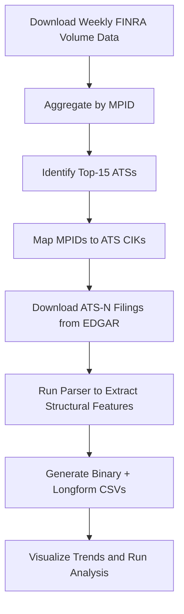

# Inside the Black Box: ATS-N Parsing and Analysis Toolkit

This repository parses and analyzes structural disclosures from **Form ATS-N filings** submitted by U.S. equity dark pools (Alternative Trading Systems, or ATSs). These filings, mandated under SEC Rule 304, offer a rare look into the internal mechanics of dark pools—segmentation, hosted pool functionality, custom order types, and more.

The goal of this project is to construct a structured panel dataset of ATS design features across time, aligned with FINRA-reported trading volume, to support empirical analysis of structural differences across venues.

---

## Project Workflow



---

## Repo Structure

```bash
.
├── data/
│   ├── volume data/           # FINRA weekly & annual ATS share volumes
│   └── ATS_filings_data/
│       ├── data_raw/          # Raw downloaded ATS-N filings (.html/.xml)
│       └── cik_lookup.csv     # Maps MPIDs to ATS CIKs and file numbers
├── seminar_parse.py           # Core parser for Form ATS-N
├── batch_runner.py            # End-to-end runner: parse all ATS filings
├── ats_feature_parser.py      # Simple CLI parser for one HTML file
├── tables/, fig/, output/     # CSVs, charts, and generated outputs
└── README.md
```

---

## Key Components

### 📄 `seminar_parse.py`

The core parser logic. It uses **BeautifulSoup** to extract structural features from ATS-N HTML filings (e.g., hosted pools, segmentation, routing permissions, IOI support).

Parsed output includes:

* `ats_features_binary.csv`: A panel of binary flags (1 = Yes, 0 = No, NaN = Unclear)
* `ats_features_longtext.csv`: Narrative descriptions for deeper case analysis

###  Volume Data

Volume is used for:

* Selecting the most active ATSs (Top-15 by cumulative shares)
* Merging structural data with annual trading activity

But **volume is not the main focus** of this repo. Parsing and structuring ATS-N filings is.

---

## Quick Start: Parse One Filing

If you want to test the parser on a single Form ATS-N HTML file, you can use the following script:

### 🔍 `ats_feature_parser.py`

```bash
python ats_feature_parser.py data/ATS_filings_data/data_raw/primary_doc.html
```

This will print a dictionary of structural features (both binary and text fields) to your terminal.

Example output:

```json
{
  "ats_id": "UBSA",
  "year": 2025,
  "offers_hosted_pool": "Yes",
  "supports_iois": "Yes",
  ...
}
```

---

## Full Pipeline (Parse All Filings)

Once you’ve downloaded all ATS-N filings into `data_raw/` and confirmed your CIK mapping in `cik_lookup.csv`, run the full pipeline:

```bash
python batch_runner.py
```

This will:

1. Parse every ATS-N file in the raw folder.
2. Write two structured datasets: `ats_features_binary.csv` and `ats_features_longtext.csv`
3. Generate:

   * Descriptive tables (feature summary, correlation, contingency)
   * Charts (feature adoption heatmaps, volume comparisons)
   * A merged ATS panel with volume and structure

---

## 🛠 Dependencies

Install from `requirements.txt` or manually:

```bash
pip install beautifulsoup4 pandas matplotlib numpy tqdm
```

---

## Suggested Citations and Sources

* SEC Form ATS-N Filings: [https://www.sec.gov/edgar](https://www.sec.gov/edgar)
* FINRA OTC/ATS Weekly Summary: [https://www.finra.org/finra-data/market-data/otc-transparency](https://www.finra.org/finra-data/market-data/otc-transparency)

---

## Notes

* The parser is **rule-based**, not ML/NLP. It uses regex patterns specific to Form ATS-N templates.
* Filings missing key structural disclosures will return `NaN` in `ats_features_binary.csv`.
* Volume data is drawn from **FINRA’s weekly summary** feed and aggregated by year.

---

## Contact

For questions, bug reports, or suggestions, feel free to open an issue or reach out to NguyenTran88(GitHub) or nqt2001@columbia.edu

---
